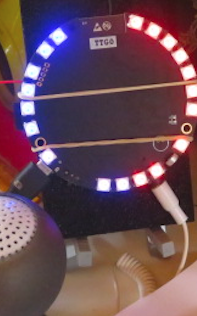
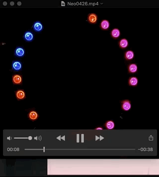
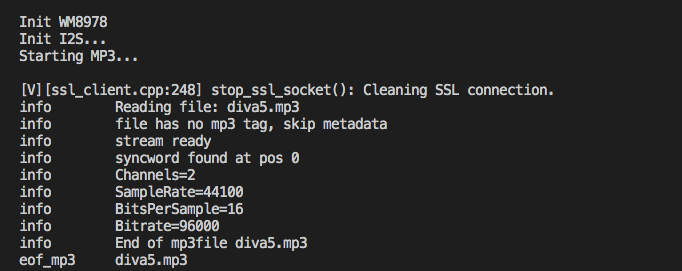

# ESP32_VU  
A simple ESP32 T-Audio I2S VU w/ NeoPixels

 &nbsp;&nbsp;&nbsp;&nbsp;&nbsp;&nbsp;
  
## I2S Output

To test the I2S Output, rename either _mainDuDu.txt or _mainDoReMi.txt to cpp, build and flash. 
The _mainDoReMi implemented 4 kinds of waveform as above picture!
  

## Play MP3

To play MP3 audio, put the file into SD card root, build _mainMP3.cpp and flash!
 
 
 

## References
  - [TTGO T-Audio IDF components](https://github.com/LilyGO/TTGO-TAudio) TTGO IDF code at Github
  - [Arduino FFT](https://github.com/kosme/arduinoFFT) Arduino Fast Fourier Transform for Arduino 
  - [NeoPixel library](https://github.com/adafruit/Adafruit_NeoPixel) Arduino Adafruit NeoPixel Library.
  - [FastLED library](https://github.com/FastLED/FastLED) Another faster NeoPixel Library.
  - [Helix MP3 I2S Audio](https://github.com/schreibfaul1/ESP32-audioI2S) Original ESP32 MP3 I2S player
